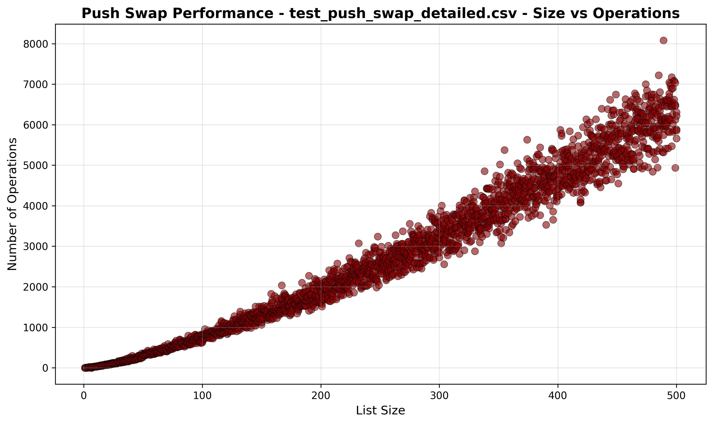

_This project has been created as part
of the 42 curriculum by abisiani_

# push_swap
Because swap_push doesn't feel as natural

 

## Description

*push_swap* physically sorts a "stack" of **unique** integers in ascending order using a limited operation set and two circular lists. The goal is to minimise the number of operations necessary in the general case, while staying within:
* For n = 100 under 1100 operations and for n = 500 in under 8500 operations.
* For n = 100 under 700 operations and for n = 500 numbers in under 11500 operations.
* For n = 100 under 1300 operations and for n = 500 numbers in under 5500 operations.

Target efficiency is:
* For n = 100: 700 or fewer operations.
* For n = 500: 5500 or fewer operations.

The operations available for use are:
* **sa** (swap a): **Swap** the first 2 elements at the top of stack a. Do nothing if there is only one element or none.
* **sb** (swap b): **Swap** the first 2 elements at the top of stack b. Do nothing if there is only one element or none.
* **ss** : sa and sb at the same time.
* **pa** (push a): Take the first element at the top of b and put it at the top of a. Do nothing if b is empty.
* **pb** (push b): Take the first element at the top of a and put it at the top of b. Do nothing if a is empty.
* **ra** (rotate a): **Shift up** all elements of stack a by 1. The first element becomes the last one.
* **rb** (rotate b): **Shift up** all elements of stack b by 1. The first element becomes the last one.
* **rr** : ra and rb at the same time.
* **rra** (reverse rotate a): **Shift down** all elements of stack a by 1. The last element becomes the first one.
* **rrb** (reverse rotate b): **Shift down** all elements of stack b by 1. The last element becomes the first one.
* **rrr** : rra and rrb at the same time.

 

### Current efficiency averages for n:

## Instructions

Build *push_swap* with `make`.

Run it by passing the elements of the list on the command line:

	./push_swap 5 4 7 3 8 0

It will output the operations it took (and any errors) to stdout:

	./push_swap 5 4 7 3 8 0
	pb
	pb
	ra
	pb
	rr
	pb
	etc..

In *bash*:

`ARG="23 234 345 123 98 65 3"; ./push_swap $ARG`

Check the result by piping everything to the checker:

`ARG="23 234 345 123 98 65 3"; ./push_swap $ARG | ./checker_linux $ARG`

## Algorithm Overview

This sort is inspired by "chunk sort" and operates in three phases:
1. Chunk Division & Ranking
	- Element series is normalised (to ease cost calculations and subdivision into chunks).
	- Elements are assigned chunks based on rank.
2. Push paired chunks to B
	- Chunks are sent to stack B in pairs, starting from the middle and working outward, e.g. for chunks 0-4, send (2, 1), then (3, 0), then 4.
	- The largest ranks (biggest values) are at the top of B in strata.
3. Greedy Insertion Sort (B → A)
	- For each element in B calculate the cost to push it back to into A at the right position.
	- Execute the cheapest insertion.
	- The cost calculation is optimizer-aware and tries to create opportunities for rr and rrr.

Finally, the list of operations executed is optimised to remove redundant pairs like `(pa, pb)`, and to condense pairs such as: `(ra, rb)` into `rr`.

## Possible improvements

- Add lookahead to the push cost calculator. When choosing the next operation, also consider the cost of the next two. This should be relatively straightforward.
- The push cost calculator could weight the cost by the relative position of each element in the chunk (to prioritise the lowest ranks so they will end up closer to their final position; this hurts opportunities for further greedy selection, see last bullet point). This could be slightly complicated to balance but might be very efficient.
- Find opportunities for sa, sb, and ss (such as after pushing, scan for cheap opportunities to swap the tops of each list into slightly better position).
- This is a rebuild. Currently the subdivision into chunks creates enough efficiency that the greedy insertion calculation provides relatively little benefit. Although the chunking has been tested to be most efficient with these chunk sizes, it limits what can be done afterwards. It might benefit efficiency to either remove the chunking, or use it differently in something akin to merge sort. There was an article alledging the efficiency of a 3-way merge sort; worth considering.

## Resources

AI was used to 
* Calculate projected operations costs of possible algorithms.
* Repeat test setup and teardown pattern for given unit test testing cases.
* Generate script to automatically repeat the test with x permutations of n numbers for all n within a range (This is to try and avoid skewed results for one permutation of n numers during manual testing).
* Generating plot_results.py (using matplotlib to view results).

Classic tutorials and resources on this challenge (not the inspirations for this project):
* [Mechanical turk algo (Medium.com)](https://medium.com/@ayogun/push-swap-c1f5d2d41e97)
* [The least amount of moves with two stacks - Jamie Dawson (Medium.com)](https://medium.com/@jamierobertdawson/push-swap-the-least-amount-of-moves-with-two-stacks-d1e76a71789a)
